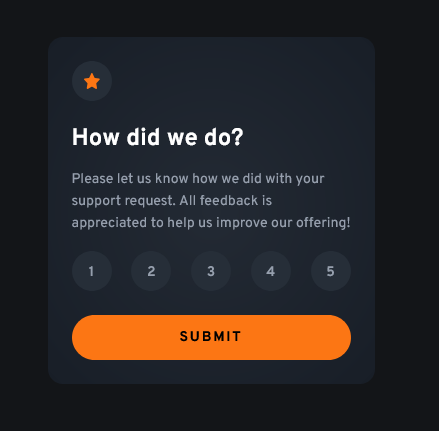

# Frontend Mentor - Interactive rating component solution

This is a solution to the [Interactive rating component challenge on Frontend Mentor](https://www.frontendmentor.io/challenges/interactive-rating-component-koxpeBUmI). Frontend Mentor challenges help you improve your coding skills by building realistic projects.

## Table of contents

-   [Overview](#overview)
    -   [The challenge](#the-challenge)
    -   [Screenshot](#screenshot)
    -   [Links](#links)
-   [My process](#my-process)
    -   [Built with](#built-with)
    -   [What I learned](#what-i-learned)
    -   [Continued development](#continued-development)
    -   [Useful resources](#useful-resources)
-   [Author](#author)
-   [Acknowledgments](#acknowledgments)

## Overview

### The challenge

Users should be able to:

-   View the optimal layout for the app depending on their device's screen size
-   See hover states for all interactive elements on the page
-   Select and submit a number rating
-   See the "Thank you" card state after submitting a rating

### Screenshot

### Links

-   Solution URL: https://github.com/leeport511/interactive-rating-comp-2025
-   Live Site URL: https://interactive-rating-app-july-2025.netlify.app/

## My process

### Built with

-   Semantic HTML5 markup
-   CSS custom properties
-   Mobile-first workflow
-   [React](https://reactjs.org/) - JS library
-   [Tailwind CSS](https://tailwindcss.com/) - For styles

### What I learned

I want to be better at React, so I tried to do with that library to start with something easy, beginner and start to increase the difficulty.

## Author

-   Leonardo Andres Portillo
-   Frontend Mentor - https://www.frontendmentor.io/profile/leeport511
